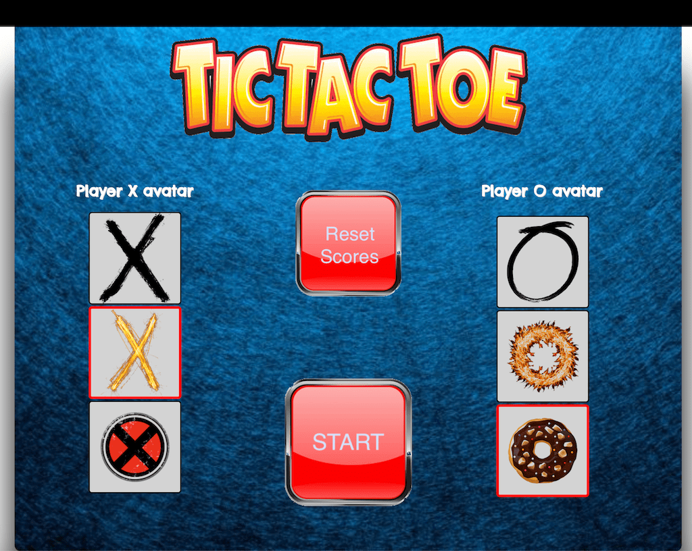

# TIC TAC TOE

Here you can see some functionalities that I used in this game.

- CSS
- Html
- JQuery
- JavaScript
- Local Storage
- Animated movements
- customize your tokens
- Multiple game rounds with counter

## How it is working.
> It is a multiplayer game, which both players can play at the same time. Player one (X) should start the game and choose an empty place for his or her move, then the second player (O) will follow that.

> At the beginning of the game, you choose an icon for each player to play with those avatars during the game. By pressing on the start button the game will start.

> You can find the scores on top of the page and has a backup in case of losing the service by using local data. Also, you have that option to reset the game and play again from zero, by choosing Reset icon from home you can start the game

> You can see the Reset when you are in the middle of the game and someone has a score, and by clicking on the button it will hide. 

> After finishing each set it will show you the result of the game by a notification, which has a Reset button to continue the game for the next round. Also, you can exit the game and choose another avatar for yourself.

## Next Versions
in the next version of the game I will add network multiplayer and an unbeatible AI opponent.

## Link of the game.
Here is a link to the game: [Tic tac toe](https://behdadset.github.io/project0/).

## Contact information.
This game is made by Behdad Setoodegan. You can contact me through email.
behdadsetoodeagn@gmail.com

