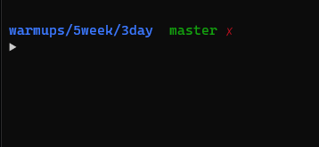

# Simon says

Implement a game of Simon Says.

- Game first prints a random number between 1-4.
- The person has to repeat it.
- The game repeats the same number and adds another one after it
- Person then repeats the sequence.
- This goes on until a player cant repeat the sequence.
- Game then prints a message, saying how much player scored.

Implement that game however you want, here is how my plays.

